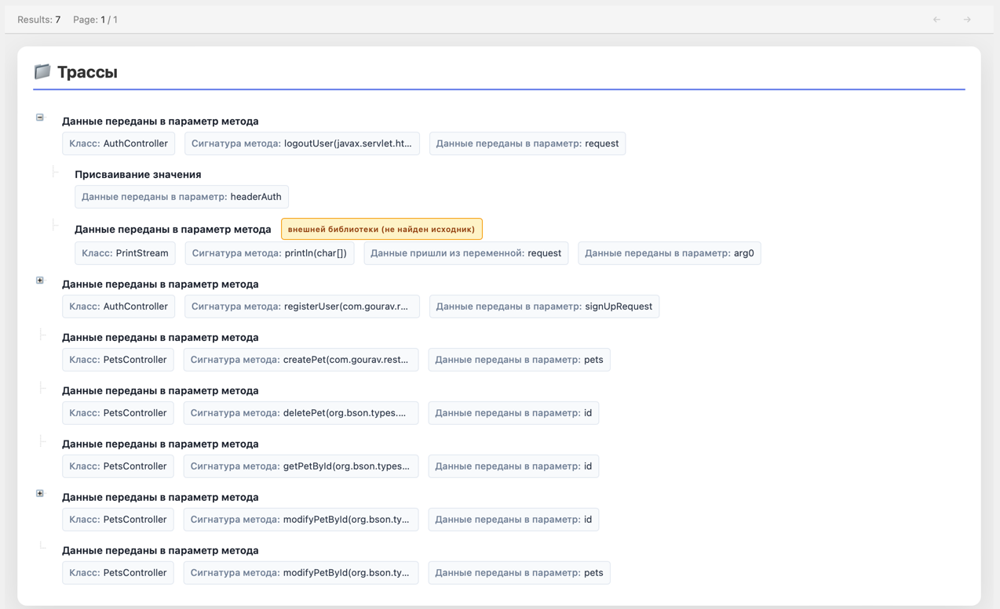

# Запуск инструмента

[Установка зависимостей](#установка-зависимостей)  
[Запуск back](#запуск-back)  
[Запуск front](#запуск-front)  
[Отображение построенных трасс (UI)](#отображение-построенных-трасс-ui)  

## Установка зависимостей

### Установка java

Если не установлена `java`, выполнить:
```shell
sudo apt update
sudo apt install openjdk-21-jdk

export JAVA_HOME=/путь/к/jdk
export PATH=$JAVA_HOME/bin:$PATH
```

### Установка npm

Если не установлен `npm`:
```shell
sudo apt update
sudo apt install npm -y
```

## Запуск back

Необходимо перейти в папку `attack_surface_search/src/main/java/` и запустить класс Main
с помощью IDE или команды:
```shell
java Main
```

Далее необходимо ввести абсолютный путь до локальной папки с проектом, который необходимо проанализировать.

В консоль будет отображаться информация об этапах анализа и результатах.

## Запуск front

При первом запуске проекта в папке `attack_surface_search/src/main/front` необходимо выполнить команду:
```shell
npm install
npm start
```
При повторном запуске только:
```shell
npm start
```


## Отображение построенных трасс (UI)

На странице браузера `http://localhost:8000` будет доступен UI приложения.


